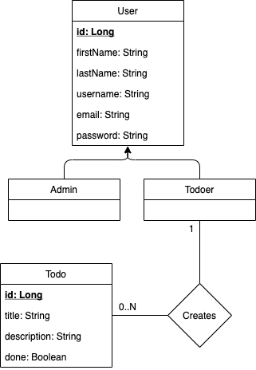

# DB Model

## Model



## Entities 

### User 

```java
@Entity
@Data
@AllArgsConstructor
@NoArgsConstructor
@Inheritance(strategy = InheritanceType.SINGLE_TABLE)
@DiscriminatorColumn(name="main_role",
        discriminatorType = DiscriminatorType.STRING)
@DiscriminatorValue(value = "ROLE_USER")
public class User {
    @Id
    @GeneratedValue
    private Long id;
    
    @NotEmpty
    private String firstName;
    
    @NotEmpty
    private String lastName;
    
    @NotEmpty
    @Column(unique = true)
    private String username;
    
    @NotEmpty
    @Column(unique = true)
    private String email;
    
    @NotEmpty
    private String password;
}
```

####  Admin

```java
@Data
@EqualsAndHashCode(callSuper = true)
@Entity
@DiscriminatorValue("ROLE_ADMIN")
public class Admin extends User {
  
}
```

#### Todoer

```java
@Data
@EqualsAndHashCode(callSuper = true)
@Entity
@DiscriminatorValue("ROLE_TODOER")
public class Todoer extends User {
  /**
  * One-To-Many relationship between Todoer and Todo.
  */
  @OneToMany(mappedBy = "todoer", cascade = CascadeType.ALL, orphanRemoval = true)
  private List<Todo> todos = new ArrayList<>();
}
```

### Todo

```java
@Entity
@Data
@AllArgsConstructor
@NoArgsConstructor
public class Todo {
	@Id
	@GeneratedValue
	private Long id;
  
  private String title;
  
  private String description;
  
  private Boolean done;
    
	/**
	* One-to-One relationship between SurveyTemplate and Class
	*/
  @OneToOne
  @JoinColumn(name = "user_id", referencedColumnName = "id")
	private User userObj = null;
}
```

